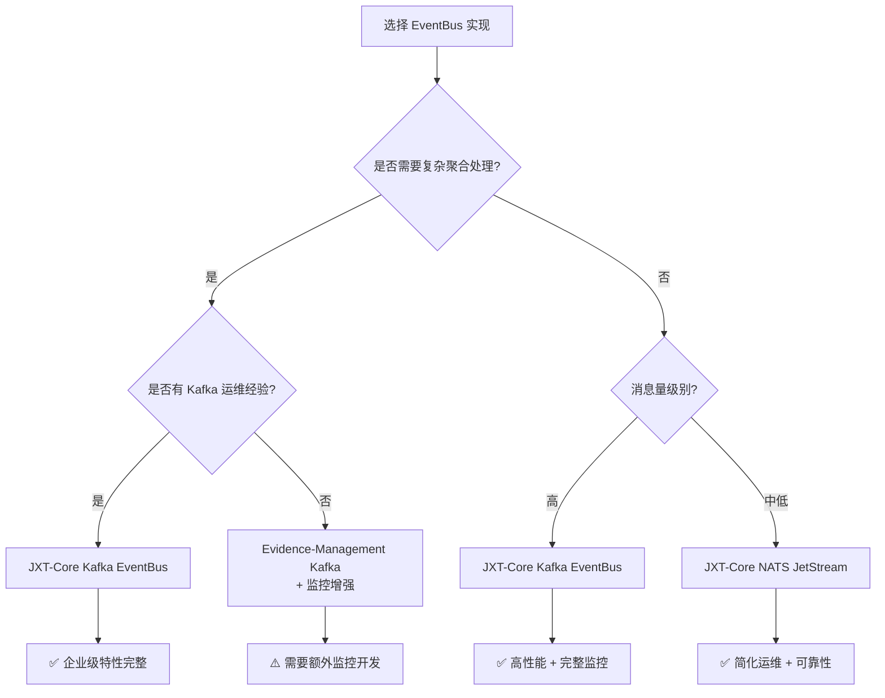

# EventBus 订阅可靠性对比分析

## 概述

本文档详细分析了 evidence-management 中的订阅部分可靠性机制，并与 jxt-core 中的 Kafka 和 NATS JetStream 实现进行对比，评估各自的可靠性保证和企业级特性。

## 1. Evidence-Management 订阅可靠性分析

### 1.1 核心架构

Evidence-management 使用基于 Watermill 的 Kafka 订阅管理器，具有以下特点：

```go
type KafkaSubscriberManager struct {
    Config                  *KafkaSubscriberConfig
    Subscriber              atomic.Value // *kafka.Subscriber
    aggregateProcessors     *cache.Cache[string, *AggregateProcessor]
    processingRate          *rate.Limiter
    isRecoveryMode          atomic.Bool
    NoBacklogDetector       atomic.Value
}
```

### 1.2 可靠性机制

#### ✅ 已实现的可靠性特性

1. **消息确认机制**
   - 支持 Ack/Nack 操作
   - 基于错误类型的智能确认策略
   - 超时处理和上下文取消支持

2. **错误处理与重试**
   - 可重试错误识别（网络错误 vs 解析错误）
   - 死信队列机制（框架已实现，待完善）
   - 指数退避重连策略

3. **聚合处理器系统**
   - 按聚合ID保证消息顺序处理
   - 恢复模式下的资源池管理
   - 空闲处理器自动回收

4. **流量控制**
   - 令牌桶限流器（golang.org/x/time/rate）
   - 背压机制防止系统过载
   - 可配置的处理速率

5. **积压检测**
   - 双重阈值检测（消息数量 + 时间）
   - 恢复模式自动切换
   - 实时积压监控

6. **健康检查与重连**
   - 连接状态监控
   - 自动重连机制
   - 重连后主题重新订阅

#### ⚠️ 存在的限制

1. **监控指标不完整**
   - 缺乏详细的 Prometheus 指标
   - 错误分类不够细致
   - 性能指标收集有限

2. **配置复杂性**
   - 多个配置参数需要精细调优
   - 恢复模式切换逻辑复杂
   - 缺乏自适应调整机制

## 2. JXT-Core Kafka EventBus 可靠性分析

### 2.1 企业级架构

```go
type kafkaEventBus struct {
    config                    *config.KafkaConfig
    producer                  sarama.SyncProducer
    consumer                  sarama.Consumer
    client                    sarama.Client
    admin                     sarama.ClusterAdmin
    
    // 企业级特性
    backlogDetector           *BacklogDetector
    rateLimiter               *RateLimiter
    aggregateProcessorManager *AggregateProcessorManager
    recoveryMode              atomic.Bool
}
```

### 2.2 可靠性优势

#### ✅ 超越 Evidence-Management 的特性

1. **更优雅的积压检测**
   ```go
   // 并发检测多个topic，复用EventBus连接
   func (bd *BacklogDetector) IsNoBacklog(ctx context.Context) (bool, error) {
       // 并发检测所有topic的积压情况
       for topic, partitions := range topics {
           wg.Add(1)
           go func(topic string, partitions []int32) {
               defer wg.Done()
               bd.checkTopicBacklog(ctx, topic, partitions, groupOffsets.Blocks[topic], lagChan)
           }(topic, partitions)
       }
   }
   ```

2. **LRU缓存管理的聚合处理器**
   ```go
   type AggregateProcessorManager struct {
       processors    *lru.Cache[string, *AggregateProcessor]  // 使用LRU缓存
       rateLimiter   *RateLimiter
       cleanupTicker *time.Ticker  // 定期清理空闲处理器
   }
   ```

3. **自适应流量控制**
   ```go
   type AdaptiveRateLimiter struct {
       *RateLimiter
       errorRate         float64
       successRate       float64
       adaptationEnabled bool
   }
   ```

#### ✅ 企业级监控指标

- 详细的消息计数和错误统计
- 处理时间分布监控
- 连接状态和健康检查指标
- 聚合处理器资源使用情况

### 2.3 架构优势

1. **统一接口设计**
   - 标准化的 EventBus 接口
   - 支持多种后端实现
   - 配置驱动的初始化

2. **资源管理优化**
   - 连接复用和池化
   - 自动资源清理
   - 内存使用优化

## 3. JXT-Core NATS JetStream 可靠性分析

### 3.1 JetStream 原生优势

NATS JetStream 提供了比 Kafka 更简单但同样可靠的消息传递保证：

```go
type natsEventBus struct {
    conn               *nats.Conn
    js                 nats.JetStreamContext
    subscriptions      map[string]*nats.Subscription
    consumers          map[string]nats.ConsumerInfo
    
    // 企业级特性
    messageCount       atomic.Int64
    errorCount         atomic.Int64
    healthStatus       atomic.Bool
    reconnectCallbacks []func(ctx context.Context) error
}
```

### 3.2 可靠性特性

#### ✅ JetStream 内置可靠性

1. **消息持久化**
   ```go
   streamConfig := &nats.StreamConfig{
       Name:      config.JetStream.Stream.Name,
       Retention: parseRetentionPolicy(config.JetStream.Stream.Retention),
       Storage:   parseStorageType(config.JetStream.Stream.Storage),
       Replicas:  config.JetStream.Stream.Replicas,
   }
   ```

2. **Pull 订阅模式**
   ```go
   func (n *natsEventBus) processPullMessages(ctx context.Context, topic string, sub *nats.Subscription, handler MessageHandler) {
       // 批量拉取消息，提供背压控制
       msgs, err := sub.Fetch(10, nats.MaxWait(time.Second))
       for _, msg := range msgs {
           n.handleMessage(ctx, topic, msg.Data, handler, func() error {
               return msg.Ack()  // 显式确认
           })
       }
   }
   ```

3. **消费者配置**
   ```go
   consumerConfig := &nats.ConsumerConfig{
       Durable:       n.config.JetStream.Consumer.DurableName,
       DeliverPolicy: parseDeliverPolicy(n.config.JetStream.Consumer.DeliverPolicy),
       AckPolicy:     parseAckPolicy(n.config.JetStream.Consumer.AckPolicy),
       MaxDeliver:    n.config.JetStream.Consumer.MaxDeliver,
       BackOff:       n.config.JetStream.Consumer.BackOff,
   }
   ```

#### ✅ 简化的可靠性模型

与 Kafka 相比，JetStream 提供了更简单的可靠性保证：

1. **内置积压管理** - 无需手动实现 BacklogDetector
2. **自动重试机制** - 通过 MaxDeliver 和 BackOff 配置
3. **流状态管理** - JetStream 自动管理流和消费者状态
4. **简化的确认模型** - 统一的 Ack/Nak 机制

### 3.3 架构简化优势

```go
// JetStream 的简化 Outbox 逻辑
func (s *Service) publishEvents(events []*OutboxEvent) {
    for _, event := range events {
        // JetStream 确认 = 消息可靠投递保证
        if ack, err := s.jetStreamPublisher.Publish(subject, event.Payload); err != nil {
            continue  // 发布失败，等待重试
        }
        // 可以安全地标记为 PUBLISHED
        s.outboxRepo.MarkAsPublished(ctx, event.ID)
    }
}
```

## 4. 可靠性对比总结

### 4.1 功能对比矩阵

| 可靠性特性 | Evidence-Management | JXT-Core Kafka | JXT-Core NATS JetStream |
|------------|-------------------|----------------|------------------------|
| 消息确认机制 | ✅ Ack/Nack | ✅ 增强版 Ack/Nack | ✅ JetStream 原生确认 |
| 错误重试 | ✅ 基础重试 | ✅ 智能重试策略 | ✅ JetStream 内置重试 |
| 死信队列 | ⚠️ 框架实现 | ✅ 完整实现 | ✅ JetStream 原生支持 |
| 流量控制 | ✅ 令牌桶 | ✅ 自适应限流 | ✅ Pull 模式背压 |
| 积压检测 | ✅ 双重阈值 | ✅ 并发检测优化 | ✅ JetStream 内置 |
| 聚合处理 | ✅ 缓存管理 | ✅ LRU 优化 | ⚠️ 需要额外实现 |
| 健康检查 | ✅ 连接监控 | ✅ 全面监控 | ✅ JetStream 状态监控 |
| 监控指标 | ⚠️ 基础指标 | ✅ 企业级指标 | ✅ JetStream 指标 |
| 配置复杂度 | ⚠️ 复杂 | ✅ 结构化配置 | ✅ 简化配置 |
| 运维复杂度 | ⚠️ 高 | ⚠️ 中等 | ✅ 低 |

### 4.2 可靠性等级评估

1. **Evidence-Management Kafka**: ⭐⭐⭐⭐ (4/5)
   - 功能完整，但配置复杂
   - 适合复杂业务场景
   - 需要专业运维支持

2. **JXT-Core Kafka**: ⭐⭐⭐⭐⭐ (5/5)
   - 企业级功能完整
   - 优化的性能和资源管理
   - 标准化接口和配置

3. **JXT-Core NATS JetStream**: ⭐⭐⭐⭐⭐ (5/5)
   - 简化的可靠性模型
   - 内置企业级特性
   - 低运维复杂度

## 5. 推荐方案

### 5.1 迁移建议

1. **短期**: 继续使用 Evidence-Management 的 Kafka 实现，补充监控指标
2. **中期**: 迁移到 JXT-Core Kafka EventBus，获得企业级特性
3. **长期**: 考虑 JXT-Core NATS JetStream，简化架构复杂度

### 5.2 选择标准

- **复杂业务场景**: JXT-Core Kafka EventBus
- **简化运维需求**: JXT-Core NATS JetStream  
- **现有系统维护**: Evidence-Management Kafka (加强监控)

## 6. 技术实现深度对比

### 6.1 消息处理流程对比

#### Evidence-Management 处理流程
```go
func (km *KafkaSubscriberManager) processMessage(ctx context.Context, msg *message.Message, handler func(msg *message.Message) error, timeout time.Duration) {
    // 1. 流量控制
    if err := km.processingRate.Wait(ctx); err != nil {
        msg.Nack()
        return
    }

    // 2. 聚合处理判断
    aggregateID := msg.Metadata.Get("aggregateID")
    if km.IsInRecoveryMode() || (aggregateID != "" && km.aggregateProcessors.Contains(aggregateID)) {
        km.processMessageWithAggregateProcessor(ctx, msg, handler, timeout)
    } else {
        km.processMessageImmediately(ctx, msg, handler, timeout)
    }
}
```

#### JXT-Core Kafka 处理流程
```go
func (h *kafkaConsumerHandler) processMessage(ctx context.Context, message *sarama.ConsumerMessage) error {
    // 1. 流量控制
    if h.eventBus.rateLimiter != nil {
        if err := h.eventBus.rateLimiter.Wait(ctx); err != nil {
            return fmt.Errorf("rate limit error: %w", err)
        }
    }

    // 2. 聚合处理（如果启用）
    if h.eventBus.aggregateProcessorManager != nil {
        aggregateID := string(message.Key)
        if aggregateID != "" {
            aggMsg := &AggregateMessage{...}
            return h.eventBus.aggregateProcessorManager.ProcessMessage(ctx, aggMsg)
        }
    }

    // 3. 直接处理
    return h.handler(ctx, message.Value)
}
```

#### JXT-Core NATS JetStream 处理流程
```go
func (n *natsEventBus) handleMessage(ctx context.Context, topic string, data []byte, handler MessageHandler, ackFunc func() error) {
    // 1. Panic 恢复
    defer func() {
        if r := recover(); r != nil {
            n.errorCount.Add(1)
            n.logger.Error("Panic in NATS message handler", zap.Any("panic", r))
        }
    }()

    // 2. 超时控制
    handlerCtx, cancel := context.WithTimeout(ctx, 5*time.Minute)
    defer cancel()

    // 3. 处理消息
    if err := handler(handlerCtx, data); err != nil {
        n.errorCount.Add(1)
        return // 不确认消息，让它重新投递
    }

    // 4. 确认消息
    if err := ackFunc(); err != nil {
        n.logger.Error("Failed to ack NATS message", zap.Error(err))
    } else {
        n.messageCount.Add(1)
    }
}
```

### 6.2 错误处理策略对比

#### Evidence-Management 错误处理
```go
func (km *KafkaSubscriberManager) isRetryableError(err error) bool {
    switch err.(type) {
    case *net.OpError, *os.SyscallError:
        return true  // 网络错误可重试
    case *json.SyntaxError, *json.UnmarshalTypeError:
        return false // 解析错误不可重试
    default:
        return false
    }
}

func (km *KafkaSubscriberManager) processMessageImmediately(ctx context.Context, msg *message.Message, handler func(msg *message.Message) error, timeout time.Duration) {
    // ... 处理逻辑
    if err == nil {
        msg.Ack()
    } else {
        if km.isRetryableError(err) {
            msg.Nack() // 可重试错误
        } else {
            km.sendToDeadLetterQueue(msg) // 不可重试错误发送到死信队列
            msg.Ack()
        }
    }
}
```

#### JXT-Core 统一错误处理
```go
// Kafka 实现中的错误处理更加统一和标准化
func (h *kafkaConsumerHandler) ConsumeClaim(session sarama.ConsumerGroupSession, claim sarama.ConsumerGroupClaim) error {
    for message := range claim.Messages() {
        if err := h.processMessage(session.Context(), message); err != nil {
            h.eventBus.logger.Error("Failed to process message",
                zap.String("topic", message.Topic),
                zap.Error(err))
            h.eventBus.errorCount.Add(1)
            // 不确认消息，让 Kafka 重新投递
        } else {
            h.eventBus.consumedMessages.Add(1)
            session.MarkMessage(message, "") // 确认消息
        }
    }
}
```

### 6.3 配置管理对比

#### Evidence-Management 配置复杂度
```go
type KafkaSubscriberConfig struct {
    KafkaConfig                      *KafkaConfig
    MaxLagThreshold                  int64
    MaxTimeThreshold                 time.Duration
    ProcessingRateLimit              rate.Limit
    ProcessingRateBurst              int
    MaxGetOrCreateProcessorAttempts  int
    IdleTimeout                      time.Duration
    MaxProcessors                    int
    // ... 20+ 配置项
}
```

#### JXT-Core 结构化配置
```yaml
eventbus:
  type: kafka
  kafka:
    brokers: ["localhost:9092"]
    producer:
      requiredAcks: 1
      timeout: 10s
    consumer:
      groupId: "jxt-consumer-group"
      sessionTimeout: 30s
    enterprise:
      rateLimiter:
        enabled: true
        ratePerSecond: 1000
        burstSize: 100
      backlogDetection:
        maxLagThreshold: 10000
        maxTimeThreshold: 5m
        checkInterval: 30s
      aggregateProcessor:
        maxProcessors: 100
        idleTimeout: 5m
```

### 6.4 监控指标对比

#### Evidence-Management 基础指标
- 消息处理计数
- 错误计数
- 处理器状态
- 积压检测结果

#### JXT-Core 企业级指标
```go
// Kafka EventBus 指标
type KafkaMetrics struct {
    PublishedMessages   atomic.Int64
    ConsumedMessages    atomic.Int64
    ErrorCount          atomic.Int64
    ProcessingDuration  *prometheus.HistogramVec
    ConnectionStatus    *prometheus.GaugeVec
    BacklogSize         *prometheus.GaugeVec
}

// NATS JetStream 指标
type NATSMetrics struct {
    MessageCount        atomic.Int64
    ErrorCount          atomic.Int64
    StreamMessages      *prometheus.GaugeVec
    ConsumerPending     *prometheus.GaugeVec
    PublishLatency      *prometheus.HistogramVec
}
```

## 7. 最佳实践建议

### 7.1 选择决策树



### 7.2 迁移路径建议

#### 阶段一：现状优化 (1-2个月)
1. **增强 Evidence-Management 监控**
   ```go
   // 添加 Prometheus 指标
   var (
       messageProcessedTotal = prometheus.NewCounterVec(...)
       messageProcessingDuration = prometheus.NewHistogramVec(...)
       processorPoolSize = prometheus.NewGaugeVec(...)
   )
   ```

2. **配置优化**
   - 调优流量控制参数
   - 优化聚合处理器配置
   - 完善死信队列处理

#### 阶段二：技术评估 (2-3个月)
1. **JXT-Core EventBus 试点**
   - 选择非关键业务进行试点
   - 性能基准测试
   - 可靠性验证

2. **对比测试**
   - 吞吐量对比
   - 延迟对比
   - 资源使用对比
   - 运维复杂度对比

#### 阶段三：逐步迁移 (3-6个月)
1. **优先级排序**
   - 新业务优先使用 JXT-Core
   - 关键业务逐步迁移
   - 非关键业务批量迁移

2. **平滑迁移策略**
   ```go
   // 双写策略示例
   type HybridEventBus struct {
       oldBus EventBus // Evidence-Management
       newBus EventBus // JXT-Core
       migrationRatio float64
   }

   func (h *HybridEventBus) Publish(ctx context.Context, topic string, message []byte) error {
       // 新系统写入
       if err := h.newBus.Publish(ctx, topic, message); err != nil {
           return err
       }

       // 按比例写入旧系统（用于对比验证）
       if rand.Float64() < h.migrationRatio {
           h.oldBus.Publish(ctx, topic, message)
       }

       return nil
   }
   ```

### 7.3 运维监控建议

#### 关键监控指标
1. **消息处理指标**
   - 消息处理速率 (messages/sec)
   - 消息处理延迟 (P50, P95, P99)
   - 错误率和错误类型分布

2. **系统健康指标**
   - 连接状态和重连次数
   - 消费者组滞后 (Consumer Lag)
   - 处理器资源使用情况

3. **业务指标**
   - 聚合处理器命中率
   - 恢复模式切换频率
   - 死信队列消息数量

#### 告警策略
```yaml
alerts:
  - name: HighMessageLag
    condition: kafka_consumer_lag > 10000
    severity: warning

  - name: HighErrorRate
    condition: error_rate > 0.05
    severity: critical

  - name: ProcessorPoolExhaustion
    condition: active_processors / max_processors > 0.9
    severity: warning
```

---

**分析结论**: JXT-Core 的 Kafka 和 NATS JetStream 实现都已经达到或超越了 Evidence-Management 的可靠性水平，并提供了更好的企业级特性和运维体验。建议根据业务复杂度和运维能力选择合适的实现方案。
