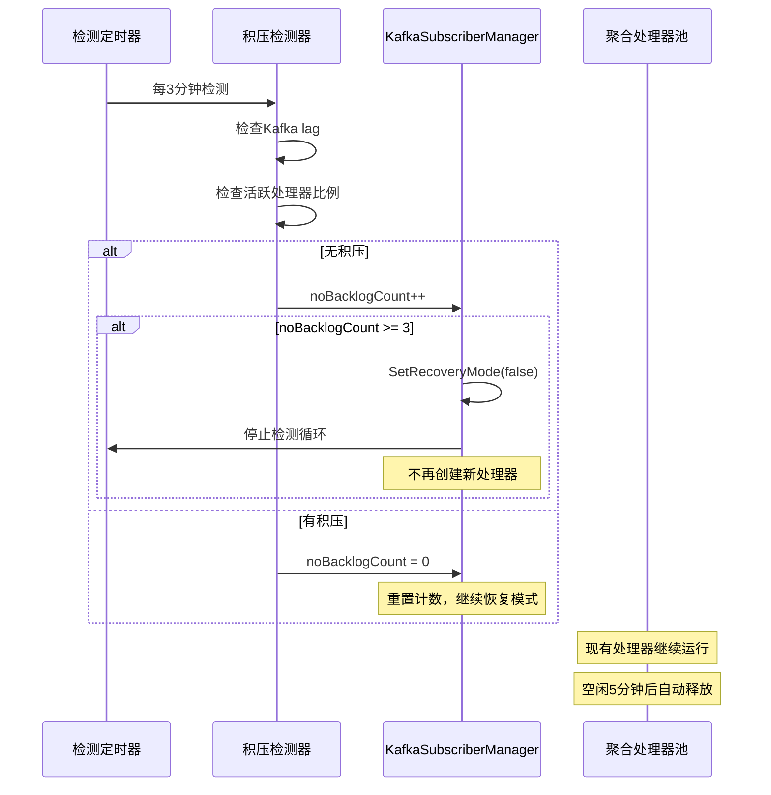

# evidence-management 项目积压检测和恢复机制详细分析

## 🔍 **积压检测发现后的处理流程**

### 1. **系统启动时的初始状态**

```go
// 系统启动时默认进入恢复模式
func NewKafkaSubscriberManager(config KafkaSubscriberManagerConfig) (*KafkaSubscriberManager, error) {
    km := &KafkaSubscriberManager{
        // ... 其他初始化
        isRecoveryMode: atomic.Bool{},
    }
    km.isRecoveryMode.Store(true) // 🔴 开始时处于恢复模式
    
    // 启动积压检测循环
    go km.startNoBacklogCheckLoop(km.noBacklogCtx)
    
    return km, nil
}
```

**关键特点**：
- ✅ **默认恢复模式**：系统启动时假设存在积压，直接进入恢复模式
- ✅ **主动检测**：启动专门的 goroutine 定期检测积压状态
- ✅ **预防性设计**：避免启动时的消息处理混乱

### 2. **积压检测循环机制**

```go
func (km *KafkaSubscriberManager) startNoBacklogCheckLoop(ctx context.Context) {
    ticker := time.NewTicker(km.Config.NoBacklogCheckInterval) // 默认 3 分钟
    defer ticker.Stop()

    for {
        select {
        case <-ticker.C:
            if km.checkNoBacklog(ctx) {
                km.noBacklogCount++
                if km.noBacklogCount >= 3 { // 🔴 连续 3 次无积压
                    km.SetRecoveryMode(false)
                    log.Println("连续三次检测无积压，切换到正常消费者状态")
                    return // 🔴 退出检测循环
                }
            } else {
                km.noBacklogCount = 0 // 🔴 重置计数
            }
        case <-ctx.Done():
            return
        }
    }
}
```

**检测策略**：
- ⏰ **定期检测**：每 3 分钟检测一次积压状态
- 🔢 **计数机制**：连续 3 次无积压才退出恢复模式
- 🔄 **重置机制**：一旦发现积压，立即重置计数器

### 3. **双重积压检测标准**

```go
func (km *KafkaSubscriberManager) checkNoBacklog(ctx context.Context) bool {
    // 1. 检查 Kafka 消费者组滞后
    noBacklog, err := subscnoBacklogDetector.IsNoBacklog(ctx)
    if err != nil || !noBacklog {
        log.Println("Backlog detected. The system is still processing messages.")
        return false
    }
    
    // 2. 检查是否有大量活跃的处理器
    if km.hasHighActiveProcessors() {
        return false
    }
    
    return true // 🔴 两个条件都满足才认为无积压
}

func (km *KafkaSubscriberManager) hasHighActiveProcessors() bool {
    total := atomic.LoadInt64(&totalProcessors)
    active := atomic.LoadInt64(&activeProcessors)
    
    // 活跃处理器占比超过阈值（默认 10%）认为仍有积压
    return float64(active)/float64(total) > km.Config.Threshold
}
```

**检测维度**：
- 📊 **Kafka 层面**：检查消费者组的 lag
- 🔧 **应用层面**：检查活跃聚合处理器的比例
- ⚖️ **双重保障**：两个维度都无积压才认为系统恢复正常

---

## 🏗️ **恢复模式下的消息处理机制**

### 1. **消息路由决策**

```go
func (km *KafkaSubscriberManager) processMessage(ctx context.Context, msg *message.Message, handler func(*message.Message) error, timeout time.Duration) {
    // 限流控制
    if err := km.processingRate.Wait(ctx); err != nil {
        msg.Nack()
        return
    }
    
    aggregateID := msg.Metadata.Get("aggregateID")
    
    // 🔴 关键决策点：选择处理方式
    if km.IsInRecoveryMode() || (aggregateID != "" && km.aggregateProcessors.Contains(aggregateID)) {
        km.processMessageWithAggregateProcessor(ctx, msg, handler, timeout)
    } else {
        km.processMessageImmediately(ctx, msg, handler, timeout)
    }
}
```

**路由策略**：
- 🔄 **恢复模式**：所有消息都进入聚合处理器
- 🔍 **存在处理器**：即使非恢复模式，如果聚合ID已有处理器，仍进入有序处理
- ⚡ **立即处理**：正常模式下无处理器的消息立即并发处理

### 2. **聚合处理器管理**

#### 处理器创建
```go
func (km *KafkaSubscriberManager) getOrCreateProcessor(ctx context.Context, aggregateID string, handler func(*message.Message) error) (*aggregateProcessor, error) {
    // 检查是否已存在
    if proc, exists := km.aggregateProcessors.Get(aggregateID); exists {
        return proc, nil
    }
    
    // 🔴 只在恢复模式下创建新处理器
    if !km.IsInRecoveryMode() {
        return nil, fmt.Errorf("not in recovery mode, cannot create new processor")
    }
    
    // 创建新处理器
    proc := &aggregateProcessor{
        aggregateID: aggregateID,
        messages:    make(chan *message.Message, 100), // 🔴 缓冲队列
        done:        make(chan struct{}),
    }
    
    // 启动处理器 goroutine
    km.wg.Add(1)
    go km.runProcessor(ctx, proc, handler)
    
    return proc, nil
}
```

#### 处理器运行逻辑
```go
func (km *KafkaSubscriberManager) runProcessor(ctx context.Context, proc *aggregateProcessor, handler func(*message.Message) error) {
    defer km.wg.Done()
    defer km.releaseProcessor(proc) // 🔴 自动释放资源
    
    for {
        select {
        case msg, ok := <-proc.messages:
            if !ok {
                return // 通道关闭，退出
            }
            
            // 🔴 有序处理消息
            if err := handler(msg); err != nil {
                if km.isRetryableError(err) {
                    msg.Nack()
                } else {
                    km.sendToDeadLetterQueue(msg)
                    msg.Ack()
                }
            }
            proc.lastActivity.Store(time.Now())
            
        case <-time.After(km.Config.IdleTimeout): // 🔴 空闲超时（5分钟）
            lastActivity := proc.lastActivity.Load().(time.Time)
            if time.Since(lastActivity) > km.Config.IdleTimeout {
                log.Printf("Processor for aggregate ID %s is idle, initiating shutdown", proc.aggregateID)
                return // 🔴 空闲超时，自动退出
            }
            
        case <-proc.done:
            return // 手动停止
            
        case <-ctx.Done():
            return // 上下文取消
        }
    }
}
```

**处理器特性**：
- 📦 **缓冲队列**：每个处理器有 100 个消息的缓冲
- ⏰ **空闲回收**：5 分钟无消息自动释放处理器
- 🔄 **有序处理**：同一聚合ID的消息严格按顺序处理
- 🛡️ **资源管理**：自动释放和清理资源

### 3. **平滑过渡机制**

```go
func (km *KafkaSubscriberManager) SetRecoveryMode(isRecovery bool) {
    km.isRecoveryMode.Store(isRecovery)
    if isRecovery {
        log.Println("Entering recovery mode: messages will be processed in order by aggregate ID")
    } else {
        log.Println("Exiting recovery mode: gradually transitioning to normal processing")
    }
}
```

**过渡策略**：
- 🔄 **渐进过渡**：退出恢复模式后，现有处理器继续运行
- ⚡ **新消息并发**：新的聚合ID消息立即并发处理
- 🕐 **自然消亡**：现有处理器空闲后自动释放
- 🎯 **最终状态**：所有处理器释放后完全进入正常模式

---

## 📊 **积压消失后的处理流程**

### 1. **积压消失检测**

```go
// 检测条件：
// 1. Kafka 消费者组无 lag
// 2. 活跃处理器比例 < 10%
// 3. 连续 3 次检测都满足上述条件
```

### 2. **模式切换流程**



### 3. **资源释放机制**

```go
func (km *KafkaSubscriberManager) releaseProcessor(proc *aggregateProcessor) {
    km.aggregateProcessors.Remove(proc.aggregateID) // 从缓存中移除
    close(proc.messages)                            // 关闭消息通道
    close(proc.done)                               // 关闭控制通道
    atomic.AddInt64(&totalProcessors, -1)          // 减少计数器
}
```

**释放触发条件**：
- ⏰ **空闲超时**：5 分钟无消息处理
- 🛑 **手动停止**：系统关闭时主动停止
- ❌ **上下文取消**：父上下文被取消

---

## 🎯 **核心设计特点分析**

### 1. **优势**

#### 🔄 **自动化恢复**
- **无需人工干预**：系统自动检测和切换模式
- **智能判断**：双重检测标准确保准确性
- **平滑过渡**：渐进式从恢复模式切换到正常模式

#### 📊 **资源效率**
- **按需创建**：只为有消息的聚合ID创建处理器
- **自动回收**：空闲处理器自动释放
- **限流控制**：防止系统资源耗尽

#### 🛡️ **可靠性保障**
- **有序处理**：确保同一聚合ID消息的顺序性
- **错误处理**：区分可重试和不可重试错误
- **死信队列**：不可重试消息进入死信队列

### 2. **局限性**

#### 🔧 **复杂性**
- **业务耦合**：恢复逻辑与消息处理逻辑紧密耦合
- **状态管理**：需要维护复杂的处理器状态
- **调试困难**：多个 goroutine 和状态使调试复杂

#### ⚡ **性能考虑**
- **内存占用**：每个聚合ID都需要独立的处理器和缓冲
- **上下文切换**：大量 goroutine 可能导致上下文切换开销
- **锁竞争**：LRU 缓存的并发访问可能存在锁竞争

#### 🎛️ **配置复杂**
- **参数调优**：多个超时和阈值参数需要仔细调优
- **业务相关**：恢复策略与具体业务场景强相关

---

## 🔍 **与 jxt-core EventBus 的对比**

| 维度 | evidence-management | jxt-core EventBus |
|------|-------------------|-------------------|
| **恢复触发** | 系统启动默认恢复模式 | 积压检测后业务层决定 |
| **恢复策略** | 固化的聚合处理器模式 | 可插拔的策略系统 |
| **资源管理** | 自动创建和释放处理器 | 业务层控制资源 |
| **模式切换** | 自动切换，连续3次无积压 | 业务层控制切换时机 |
| **处理方式** | 有序处理（按聚合ID） | 策略可定制 |
| **配置复杂度** | 多个固定参数 | 灵活的策略配置 |
| **业务耦合度** | 高度耦合 | 松耦合 |
| **扩展性** | 固化策略，难扩展 | 高度可扩展 |

---

## 💡 **总结**

evidence-management 的积压恢复机制是一个**完整的、自动化的解决方案**，特别适合：

### ✅ **适用场景**
- **固定业务模式**：消息处理模式相对固定
- **聚合根场景**：基于聚合ID的有序处理需求
- **自动化要求**：希望系统自动处理积压恢复

### ⚠️ **限制场景**
- **多样化需求**：不同业务场景需要不同恢复策略
- **高度定制**：需要精确控制恢复行为
- **性能敏感**：对内存和CPU使用有严格要求

这种设计体现了**业务特化**的思路，通过内置的恢复机制解决特定场景下的积压问题，但也因此限制了其通用性和扩展性。
