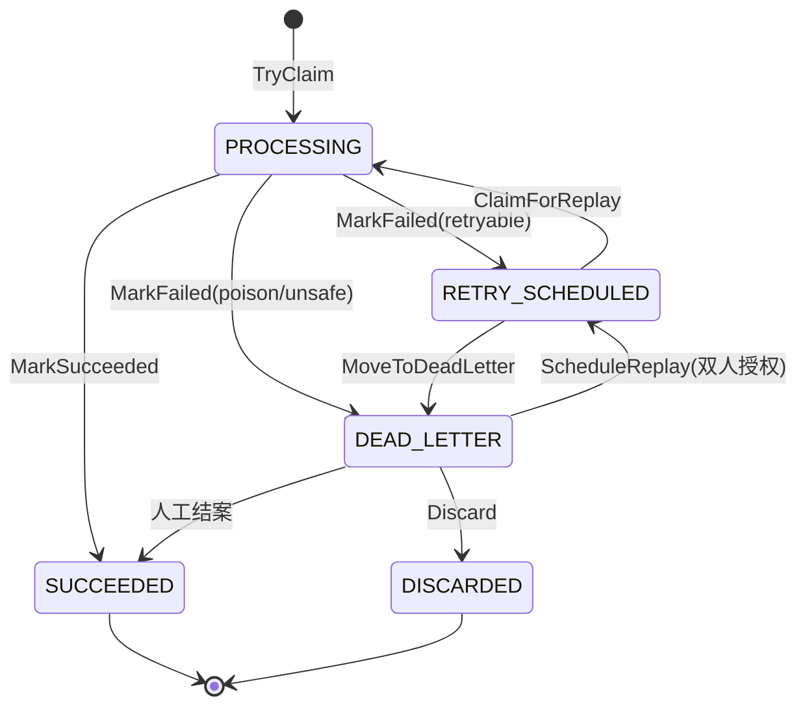

# reliable 包 README Implementation Plan

> **For agentic workers:** REQUIRED SUB-SKILL: Use superpowers:subagent-driven-development (recommended) or superpowers:executing-plans to implement this plan task-by-task. Steps use checkbox (`- [ ]`) syntax for tracking.

**Goal:** 新增 `sdk/pkg/reliable/README.md`，作为 reliable 内核的中文入口/导览文档（双受众、接入优先）。

**Architecture:** 单文件纯文档。每个章节先核对权威代码（`state.go` / 各 `doc.go` / 真实 API 签名 / 子包路径）再落笔，避免与代码漂移。README 仅 illustrative，权威仍为代码 + §spec。

**Tech Stack:** Markdown（含 Mermaid `stateDiagram-v2`，GitHub 原生渲染）。不涉及 Go 代码改动。

## Global Constraints

- **语言**：中文；代码标识符、文件路径、API 名保留原文。对齐 `sdk/pkg/eventbus/README.md`、`sdk/pkg/tenant/README.md` 风格（TOC + 章节 + Go 代码块）。
- **篇幅**：目标 ~150-180 行。
- **单一真相源**：`state.go` + 各 `doc.go` + §spec（opus5-RCC-v2）为权威；README 所有图/示例皆 illustrative，并标注「以代码为准」。
- **YAGNI（不写入 README）**：replay-safety 决策矩阵、完整状态转移表、Store 逐方法契约、§spec 映射表。
- **单文件**：仅新增 `sdk/pkg/reliable/README.md`，不改任何 .go 文件。
- **平台**：Windows / bash；gofmt 不涉及（.md）；验收须 `go build ./...` 维持通过（README 不影响 build，作回归确认）。
- **分支**：`docs/reliable-readme`（已创建并已提交 spec `dae34bd`）。

---

## File Structure

- Create: `sdk/pkg/reliable/README.md`（唯一新增文件）
- 不修改任何现有文件。

权威来源（写作时核对，勿凭记忆）：
- `sdk/pkg/reliable/state.go` — `Status*` 常量 + `legalTransitions`（状态机唯一真相源）
- `sdk/pkg/reliable/doc.go`（根）— 关键不变量
- `sdk/pkg/reliable/replay/scheduler.go` — `NewScheduler` / `Run` / `Option`
- `sdk/pkg/reliable/replay/registry.go` — `HandlerRegistry` / `HandlerInfo`
- `sdk/pkg/reliable/lease/runner.go` — `NewRunner` / `Run`
- `sdk/pkg/reliable/store/{mysql,postgres}/classify.go` — `NewStore` / `NewQuarantineStore`
- `sdk/pkg/reliable/store/{mysql,postgres}/migration.go` — `Migration()`

---

## Task 1: 骨架（标题 + 一句话 + TOC）

**Files:**
- Create: `sdk/pkg/reliable/README.md`

**Produces:** README 文件存在，含标题、§1 一句话、TOC。

- [ ] **Step 1: 写入骨架内容**

创建 `sdk/pkg/reliable/README.md`，内容：

````markdown
# reliable — 可靠消费内核

> jxt-core 的可靠消费内核：一张 `event_consumption` 表实现幂等 + 死信 + 重投调度，五状态机 + fencing token，at-least-once 语义。根包零第三方依赖（J2）。

## 目录

- [快速开始](#快速开始)
- [核心概念](#核心概念)
- [包结构](#包结构)
- [关键不变量](#关键不变量)
- [文档地图](#文档地图)

## 快速开始
````

（以「## 快速开始」结尾，留作 Task 2 接续。）

- [ ] **Step 2: 验证文件存在 + TOC 锚点**

Run: `test -f sdk/pkg/reliable/README.md && echo OK`
Expected: `OK`

目视确认 TOC 的 5 个锚点与下面各章节标题一一对应（GitHub 中文锚点 = 小写标题原文，连字符替换空格；此处标题无空格，锚点=标题原文）。

- [ ] **Step 3: 回归确认**

Run: `go build ./...`
Expected: 退出码 0（README 不影响 build；仅作未误改 .go 的确认）。

- [ ] **Step 4: Commit**

```bash
git add sdk/pkg/reliable/README.md
git commit -m "docs(reliable): add README skeleton (title, one-liner, TOC)"
```

---

## Task 2: §2 快速开始（Go 接入示例）

**Files:**
- Modify: `sdk/pkg/reliable/README.md`（在 `## 快速开始` 下追加）

**Consumes（写作前核对的权威签名，勿改）：**
- `replay.NewScheduler(s store.Store, db *gorm.DB, reg HandlerRegistry, m reliable.ConsumptionMetrics, a reliable.Alerter, opts ...Option) *Scheduler`（`replay/scheduler.go:34`）
- `(*Scheduler).Run(ctx context.Context, interval time.Duration) error`（`replay/scheduler.go:78`）
- `replay.HandlerRegistry`：`Lookup(id reliable.HandlerID) (HandlerInfo, bool)` + `All() []HandlerInfo`（`replay/registry.go:18`）
- `replay.HandlerInfo{HandlerID reliable.HandlerID; ReplaySafety reliable.ReplaySafety; RequiresAggregateGate bool; Handler reliable.ReplayableHandler}`（`replay/registry.go:10`）
- `reliable.ReplayableHandler`：`Handle(context.Context, []byte, reliable.DeliveryMeta) error` + `HandlerID() HandlerID` + `ReplaySafety() ReplaySafety` + `RequiresAggregateGate() bool`
- `mysql.NewStore(db *gorm.DB) store.Store`、`mysql.NewQuarantineStore(db *gorm.DB) store.QuarantineStore`（`store/mysql/classify.go`）
- `mysql.Migration() func(*gorm.DB) error`（`store/mysql/migration.go`）
- `reliable.ReplayIdempotent`（`reliable/safety.go`）；`NewScheduler` 对 `nil` metrics/alerter 内部回退 `NoOp`。

- [ ] **Step 1: 先核对签名（防漂移）**

Run:
```bash
grep -n "func NewScheduler" sdk/pkg/reliable/replay/scheduler.go
grep -n "func.*Run(ctx context.Context, interval" sdk/pkg/reliable/replay/scheduler.go
grep -n "type HandlerRegistry" sdk/pkg/reliable/replay/registry.go
grep -n "func.*NewStore(db" sdk/pkg/reliable/store/mysql/classify.go
grep -n "func Migration" sdk/pkg/reliable/store/mysql/migration.go
```
Expected: 每条命中一行，签名与上方「Consumes」一致。若任一不符，**先更新本计划的 Consumes 再动笔**。

- [ ] **Step 2: 追加快速开始正文**

在 `## 快速开始` 下一行起新增：

````markdown
最小接入：建表 → 实现 handler + registry → 启动重放调度器。代码 illustrative，签名以代码为准。

```go
package main

import (
	"context"
	"time"

	"github.com/ChenBigdata421/jxt-core/sdk/pkg/reliable"
	"github.com/ChenBigdata421/jxt-core/sdk/pkg/reliable/replay"
	"github.com/ChenBigdata421/jxt-core/sdk/pkg/reliable/store/mysql"
	"gorm.io/gorm"
)

// 1) handler：声明 replay 安全类别 + 是否需要聚合级串行（aggregate gate）。
type mediaHandler struct{}

func (mediaHandler) HandlerID() reliable.HandlerID       { return "media" }
func (mediaHandler) ReplaySafety() reliable.ReplaySafety { return reliable.ReplayIdempotent }
func (mediaHandler) RequiresAggregateGate() bool         { return false }
func (mediaHandler) Handle(ctx context.Context, payload []byte, meta reliable.DeliveryMeta) error {
	// 处理 payload；返回 reliable.ErrRetryLater 让路，其它错误按失败结算。
	return nil
}

// 2) registry：scheduler 凭 HandlerID 定位 handler。
type registry struct{ hs []replay.HandlerInfo }

func (r *registry) Lookup(id reliable.HandlerID) (replay.HandlerInfo, bool) {
	for _, h := range r.hs {
		if h.HandlerID == id {
			return h, true
		}
	}
	return replay.HandlerInfo{}, false
}
func (r *registry) All() []replay.HandlerInfo { return r.hs }

func run(ctx context.Context, db *gorm.DB) error {
	// 3) 建表（DSN 须 multiStatements=true）。
	if err := mysql.Migration()(db); err != nil {
		return err
	}
	st := mysql.NewStore(db) // event_consumption 读写

	// 4) 启动重放调度器，驱动 RETRY_SCHEDULED 队列。
	sch := replay.NewScheduler(st, db, &registry{hs: []replay.HandlerInfo{
		{HandlerID: "media", ReplaySafety: reliable.ReplayIdempotent, Handler: mediaHandler{}},
	}}, nil, nil) // metrics / alerter 传 nil → 内部回退 NoOp
	return sch.Run(ctx, 5*time.Second) // 每 5s 一轮 tick
}
```

> 生产用法还需：用 `mysql.NewQuarantineStore(db)` 接不可解码坏消息的隔离区；起 `lease.Runner`（见[包结构](#包结构)）观测租约孤儿；注入真实的 `ConsumptionMetrics` / `Alerter`。

## 核心概念
````

（以「## 核心概念」结尾，留作 Task 3 接续。）

- [ ] **Step 3: 逐行复核 snippet 与签名一致**

目视核对：`replay.NewScheduler(Store, *gorm.DB, HandlerRegistry, Metrics, Alerter, ...)`、`sch.Run(ctx, time.Duration)`、`HandlerInfo` 字段名、`ReplayableHandler` 四方法，全部与 Step 1 grep 出的签名一致。

- [ ] **Step 4: 回归确认**

Run: `go build ./...`
Expected: 退出码 0。

- [ ] **Step 5: Commit**

```bash
git add sdk/pkg/reliable/README.md
git commit -m "docs(reliable): add quick-start (handler + registry + scheduler wiring)"
```

---

## Task 3: §3 核心概念（Mermaid 状态机 + 心智模型）

**Files:**
- Modify: `sdk/pkg/reliable/README.md`（在 `## 核心概念` 下追加）

**Consumes（唯一真相源）：** `sdk/pkg/reliable/state.go` 的 `Status*` 常量与 `legalTransitions`。

`legalTransitions`（核对基准）：
- `PROCESSING → {SUCCEEDED, RETRY_SCHEDULED, DEAD_LETTER}`
- `RETRY_SCHEDULED → {PROCESSING, DEAD_LETTER}`
- `DEAD_LETTER → {RETRY_SCHEDULED, DISCARDED, SUCCEEDED}`
- `SUCCEEDED → {}（终态）`、`DISCARDED → {}（终态）`

- [ ] **Step 1: 核对状态与转移**

Run: `grep -n "StatusProcessing\|StatusSucceeded\|StatusRetryScheduled\|StatusDeadLetter\|StatusDiscarded\|legalTransitions" sdk/pkg/reliable/state.go`
Expected: 5 个状态常量 + `legalTransitions` 定义均命中，与上方基准一致。

- [ ] **Step 2: 追加核心概念正文**

在 `## 核心概念` 下一行起新增：

````markdown
**五状态机**（状态与合法转移以 `state.go`（`Status*` 常量 + `legalTransitions`）为准；下图为示意）：



- **一张表三用（M1）**：`event_consumption` 同时承担幂等去重、死信、重投调度，无需额外队列表。
- **fencing token**：每次占位发新的 `ClaimToken`（`claim_id`），结算须出示它。这让「UPDATE 0 行」从设计边界变成**可判定异常**——能区分「已被别实例接管」与「真失败」。
- **at-least-once + 租约自愈**：handler 处理期间持租约；进程崩溃留下 `PROCESSING` 孤儿行，由 `lease.Runner` 观测 + broker 重投恢复（可能重复执行，故 handler 须标 `ReplaySafety`）。
- **aggregate gate**：`RequiresAggregateGate=true` 的 handler，重放前先抢 (tenant, aggregate) 级 lease，保证同聚合串行——对非幂等 handler 尤其关键。
- **replay safety**：每个 handler 声明 `Idempotent`/`Deterministic`/`ExternalEffect`/`NotSelfReplayable`，决定能否自动重放（细节见 `safety.go`）。

## 包结构
````

（以「## 包结构」结尾，留作 Task 4 接续。）

- [ ] **Step 3: 复核 Mermaid 转移 = legalTransitions**

目视确认 Mermaid 的每条边都在 Step 1 基准内，且基准内每条合法转移都有对应边（或被合理省略并仍合法）。重点：`DEAD_LETTER` 出度为 3（RETRY_SCHEDULED/DISCARDED/SUCCEEDED），终态为 SUCCEEDED/DISCARDED。

- [ ] **Step 4: 回归确认**

Run: `go build ./...`
Expected: 退出码 0。

- [ ] **Step 5: Commit**

```bash
git add sdk/pkg/reliable/README.md
git commit -m "docs(reliable): add core concepts (state machine + mental model)"
```

---

## Task 4: §4 包结构 + §6 文档地图

**Files:**
- Modify: `sdk/pkg/reliable/README.md`

**Consumes（核对基准）：** 子包路径 + 各 `doc.go` 存在性。

- [ ] **Step 1: 核对子包与 doc.go 存在**

Run:
```bash
ls sdk/pkg/reliable/doc.go
ls sdk/pkg/reliable/store/doc.go sdk/pkg/reliable/store/gormshared/doc.go
ls sdk/pkg/reliable/store/mysql/doc.go sdk/pkg/reliable/store/postgres/doc.go
ls sdk/pkg/reliable/store/repotest/doc.go
ls sdk/pkg/reliable/replay/doc.go sdk/pkg/reliable/lease/doc.go
```
Expected: 全部存在（无 "No such file"）。共 8 个 `doc.go`（根 + 7 子包）。

- [ ] **Step 2: 追加包结构 + 文档地图**

在 `## 包结构` 下一行起新增：

````markdown
| 包 | 职责 | 文档 |
|----|------|------|
| `reliable`（根） | 契约类型 + 纯函数（`Status`/`Key`/`ClaimInput`/`Decision`/`ReplaySafety`/`ErrorClass`/分类器雏形）。零第三方依赖。 | `doc.go` |
| `reliable/store` | `Store` / `QuarantineStore` 接口 + `Row` / `QuarantineRow`。 | `store/doc.go` |
| `reliable/store/gormshared` | MySQL / PostgreSQL 共享 GORM 实现。 | `store/gormshared/doc.go` |
| `reliable/store/mysql` `reliable/store/postgres` | 方言 migration SQL + classifier + `NewStore`。 | `store/{mysql,postgres}/doc.go` |
| `reliable/store/repotest` | 双方言 conformance 套件（准入门禁）。 | `store/repotest/doc.go` |
| `reliable/replay` | eligible-head 重放调度器（`Scheduler`）。 | `replay/doc.go` |
| `reliable/lease` | 租约孤儿观测 runner。 | `lease/doc.go` |

## 关键不变量

（Task 5 填充）

## 文档地图

- **`doc.go`（8 个，根 + 7 子包）**：每个类型的契约与设计注记，参考型文档主体。
- **`PR2_SCOPE.md`（仓库根）**：PR-2 范围、设计决策、PR-3 / PR-7 carry-over。
- **§spec（opus5-RCC-v2 §1~§8）**：代码注释中大量 `§N` 引用指向的外部规范；本 README 不复述。
- **conformance 套件**：`reliable/store/repotest`——双方言（MySQL/PostgreSQL）下的行为真相源。
````

（注意：上面在「## 关键不变量」下留了一行占位「（Task 5 填充）」，Task 5 会替换它。）

- [ ] **Step 3: 复核表格路径**

目视确认表格 7 行包路径与 Step 1 `ls` 命中的目录一致；文档地图列的「8 个 doc.go」与 Step 1 计数一致。

- [ ] **Step 4: 回归确认**

Run: `go build ./...`
Expected: 退出码 0。

- [ ] **Step 5: Commit**

```bash
git add sdk/pkg/reliable/README.md
git commit -m "docs(reliable): add package layout + documentation map"
```

---

## Task 5: §5 关键不变量

**Files:**
- Modify: `sdk/pkg/reliable/README.md`（替换 Task 4 留下的「（Task 5 填充）」占位）

**Consumes（核对基准）：** `sdk/pkg/reliable/doc.go`（根）的不变量条目；`store.go` 的接口注释；本会话已合入的 review 修复（tenant 作用域、CAS `res.Error`）。

- [ ] **Step 1: 核对不变量来源**

Run: `sed -n '1,12p' sdk/pkg/reliable/doc.go`
Expected: 看到根 doc.go 的「关键不变量」列表（一张表三用 / 五状态机 / TryClaim 独立提交 / claim_id 校验）。

- [ ] **Step 2: 替换占位为不变量正文**

把 Task 4 留下的：

```markdown
## 关键不变量

（Task 5 填充）
```

整体替换为：

````markdown
## 关键不变量

- **一张表三用（M1）**：`event_consumption` = 幂等 + 死信 + 重投调度。
- **TryClaim 独立提交**：`NewStore` 构造期派生独立 session（§3.3）；`Mark*`/`AdvanceDue` 等显式接收调用方 `*gorm.DB`，可加入业务事务（M14）。
- **fencing**：`Mark*` 须出示 `claim_id`（`ClaimToken`）；0 行 = 可判定异常，非设计边界（M3）。
- **§2.4 列清空规则**：状态迁移时按不变量表清 ownership / 错误字段。
- **aggregate gate 前置**：抢不到 gate 整行不动、`attempt` 不增，下一周期重试。
- **多租户隔离**：`GetByID`/`List`/`MarkResolved` 强制 `tenant` 作用域；部署模型为每租户独立库（S3）。
- **CAS 写路径传播 `res.Error`**：DB 错误/ctx 取消不被伪装成 `ErrConflict`（先查 `*gorm.DB.Error` 再看 `RowsAffected`）。
````

- [ ] **Step 3: 复核与来源一致**

目视确认 7 条不变量均能在 `doc.go` / `store.go` / 已合入代码中找到对应；措辞为白话，不复述完整 CHECK 约束。

- [ ] **Step 4: 回归确认**

Run: `go build ./...`
Expected: 退出码 0。

- [ ] **Step 5: Commit**

```bash
git add sdk/pkg/reliable/README.md
git commit -m "docs(reliable): add key invariants section"
```

---

## Task 6: 终检（篇幅 / 锚点 / 非目标审计 / 回归）

**Files:**
- Modify: `sdk/pkg/reliable/README.md`（仅做终检与必要微调）

- [ ] **Step 1: 篇幅**

Run: `wc -l sdk/pkg/reliable/README.md`
Expected: 落在 ~150-180 行。若超 200，回看 Task 2/3 是否可精简（不删章节，挤措辞）；若不足 120，检查是否有章节未落笔。

- [ ] **Step 2: 锚点自洽**

目视确认 TOC 5 条 `[xxx](#xxx)` 与正文中 5 个 `##` 二级标题一一对应、中文锚点拼写一致。

- [ ] **Step 3: 非目标审计（YAGNI）**

通读全文，确认**未**出现：replay-safety 决策矩阵、完整状态转移表（Mermaid 不算）、Store 逐方法契约、§spec 章节映射表。若混入，删除。

- [ ] **Step 4: 漂移终检**

- Mermaid 状态名/转移 ≡ `state.go`。
- 包结构表 7 行 ≡ 实际子包。
- 文档地图「8 个 doc.go」≡ Step 1 计数。
- quick-start 签名 ≡ `replay/scheduler.go`、`registry.go`、`store/mysql/classify.go`。

- [ ] **Step 5: 最终回归**

Run: `go build ./...`
Expected: 退出码 0（README 未误改任何 .go）。

- [ ] **Step 6: Commit（仅当 Step 1-4 有微调；否则跳过）**

```bash
git add sdk/pkg/reliable/README.md
git commit -m "docs(reliable): polish README (length/anchors/final drift check)"
```

---

## Self-Review（plan 作者已完成）

- **Spec coverage**：spec 的 6 节大纲 → Task 1(§1+TOC) / Task 2(§2) / Task 3(§3) / Task 4(§4+§6) / Task 5(§5) / Task 6(验收)；D1 Mermaid→Task 3；D2 真 Go→Task 2；D3 单一真相源→每 Task 的「核对」step；D4 篇幅→Task 6 Step 1；D5 YAGNI→Task 6 Step 3。验收标准 1-6 全覆盖。
- **Placeholder scan**：无 TBD/TODO；Task 4/5 之间的「（Task 5 填充）」是**有意的跨任务接力标记**，Task 5 Step 2 显式替换它，非遗留占位。
- **Type consistency**：`HandlerInfo` 字段名（`HandlerID`/`ReplaySafety`/`RequiresAggregateGate`/`Handler`）、`NewScheduler` 入参顺序、`Run(ctx, time.Duration)` 在 Task 2 snippet 与各 Task 的 Consumes 间一致。
