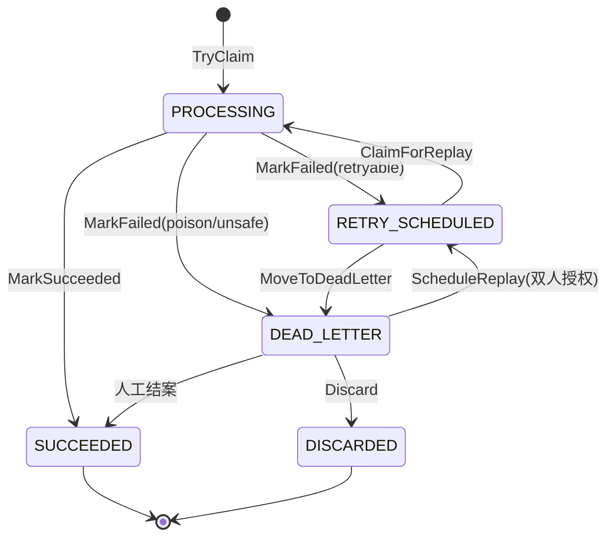

# reliable — 可靠消费内核

> jxt-core 的可靠消费内核：一张 `event_consumption` 表实现幂等 + 死信 + 重投调度，五状态机 + fencing token，at-least-once 语义。根包零第三方依赖（J2）。

## 目录

- [快速开始](#快速开始)
- [核心概念](#核心概念)
- [包结构](#包结构)
- [关键不变量](#关键不变量)
- [文档地图](#文档地图)

## 快速开始

最小接入：建表 → 实现 handler + registry → 启动重放调度器。代码 illustrative，签名以代码为准。

```go
package main

import (
	"context"
	"time"

	"github.com/ChenBigdata421/jxt-core/sdk/pkg/reliable"
	"github.com/ChenBigdata421/jxt-core/sdk/pkg/reliable/replay"
	"github.com/ChenBigdata421/jxt-core/sdk/pkg/reliable/store/mysql"
	"gorm.io/gorm"
)

// 1) handler：声明 replay 安全类别 + 是否需要聚合级串行（aggregate gate）。
type mediaHandler struct{}

func (mediaHandler) HandlerID() reliable.HandlerID       { return "media" }
func (mediaHandler) ReplaySafety() reliable.ReplaySafety { return reliable.ReplayIdempotent }
func (mediaHandler) RequiresAggregateGate() bool         { return false }
func (mediaHandler) Handle(ctx context.Context, payload []byte, meta reliable.DeliveryMeta) error {
	// 处理 payload；返回 reliable.ErrRetryLater 让路，其它错误按失败结算。
	return nil
}

// 2) registry：scheduler 凭 HandlerID 定位 handler。
type registry struct{ hs []replay.HandlerInfo }

func (r *registry) Lookup(id reliable.HandlerID) (replay.HandlerInfo, bool) {
	for _, h := range r.hs {
		if h.HandlerID == id {
			return h, true
		}
	}
	return replay.HandlerInfo{}, false
}
func (r *registry) All() []replay.HandlerInfo { return r.hs }

func run(ctx context.Context, db *gorm.DB) error {
	// 3) 建表（DSN 须 multiStatements=true）。
	if err := mysql.Migration()(db); err != nil {
		return err
	}
	st := mysql.NewStore(db) // event_consumption 读写

	// 4) 启动重放调度器，驱动 RETRY_SCHEDULED 队列。
	sch := replay.NewScheduler(st, db, &registry{hs: []replay.HandlerInfo{
		{HandlerID: "media", ReplaySafety: reliable.ReplayIdempotent, Handler: mediaHandler{}},
	}}, nil, nil) // metrics / alerter 传 nil → 内部回退 NoOp
	return sch.Run(ctx, 5*time.Second) // 每 5s 一轮 tick
}
```

> 生产用法还需：用 `mysql.NewQuarantineStore(db)` 接不可解码坏消息的隔离区；起 `lease.Runner`（见[包结构](#包结构)）观测租约孤儿；注入真实的 `ConsumptionMetrics` / `Alerter`。

## 核心概念

**五状态机**（状态与合法转移以 `state.go`（`Status*` 常量 + `legalTransitions`）为准；下图为示意）：



- **一张表三用（M1）**：`event_consumption` 同时承担幂等去重、死信、重投调度，无需额外队列表。
- **fencing token**：每次占位发新的 `ClaimToken`（`claim_id`），结算须出示它。这让「UPDATE 0 行」从设计边界变成**可判定异常**——能区分「已被别实例接管」与「真失败」。
- **at-least-once + 租约自愈**：handler 处理期间持租约；进程崩溃留下 `PROCESSING` 孤儿行，由 `lease.Runner` 观测 + broker 重投恢复（可能重复执行，故 handler 须标 `ReplaySafety`）。
- **aggregate gate**：`RequiresAggregateGate=true` 的 handler，重放前先抢 (tenant, aggregate) 级 lease，保证同聚合串行——对非幂等 handler 尤其关键。
- **replay safety**：每个 handler 声明 `Idempotent`/`Deterministic`/`ExternalEffect`/`NotSelfReplayable`，决定能否自动重放（细节见 `safety.go`）。

## 包结构
